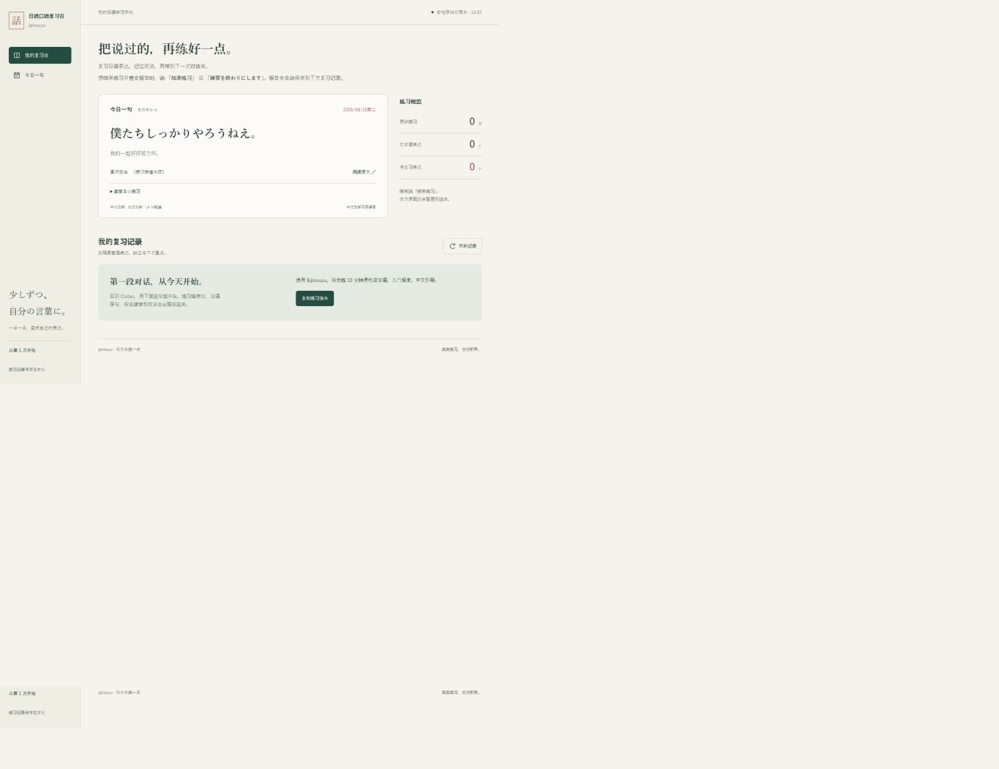

# jpkouyu 日语口语练习台

jpkouyu 是一个面向中文使用者的日语口语陪练 Skill。它会先帮你准备场景词汇和句型，再进行日语角色扮演；练习结束后整理真实表达、纠正内容和下次重点，并保存到本地复习台。

## 能做什么

- 练习便利店、餐厅、咖啡店、车站、酒店、理发店、购物、旅行、朋友聊天、面试和工作沟通等真实场景。
- 支持零基础、入门、中级、进阶四种程度。
- 支持 5、10、20、40 分钟训练，也可以指定其他时长。
- 提供沉浸式、引导式、学习式三种中文辅助强度。
- 为生词和关键句标注假名；假名不熟时可以临时使用罗马音辅助。
- 根据角色区分です／ます体、普通体和商务敬语。
- 优先纠正影响理解、反复出现或与本课目标直接相关的问题。
- 区分独立表达、中文提示后表达、关键词提示后表达和模仿表达。
- 自动生成练习报告，并把记录保存到本地复习台。
- 每天展示一句日语小说节选，附中文译意、读音、语境、口头小练习和原文链接。

仅在能够听到原始音频时分析长音、促音、清浊音和节奏。纯文字或语音转写可以检查用词与语法，但不会被当成真实发音证据。

## 怎么使用

### 1. 开始一次练习

直接在 Codex 中发送：

~~~text
使用 $jpkouyu 帮我做一次 10 分钟的日语口语训练。
主题：便利店结账
程度：入门
辅助：中文引导，汉字标假名
~~~

也可以只说：

~~~text
使用 $jpkouyu 练习日语。
~~~

信息不足时，Skill 会帮你确定主题、时长、程度和辅助方式。默认设置为 10 分钟、入门、引导式、汉字标注假名、です／ます体。

### 2. 查看预习卡

正式对话前会出现：

- 场景、双方角色和本次任务；
- 需要识别的日语词汇；
- 常用短语和完整句型；
- 可能遇到的问题；
- 本次练习的小目标。

说 **「准备好了」** 或 **「準備できました」** 后开始角色扮演。

### 3. 进行角色扮演

Skill 会扮演店员、服务人员、同事或朋友。你使用日语回答；卡住时可以说“给我一点提示”“给我关键词”或“给我完整示范”。

| 模式 | 适合情况 | 提示方式 |
|---|---|---|
| 沉浸式 | 想模拟真实交流 | 优先使用日语，卡住时才给提示 |
| 引导式 | 大多数练习 | 在关键位置给中文表达方向 |
| 学习式 | 初次接触场景 | 更早提供中文方向和日语关键词 |

### 4. 结束并查看报告

想结束练习并查看报告时，说：

~~~text
结束练习
~~~

也可以说：

~~~text
練習を終わりにします
~~~

Skill 会立即退出角色扮演，生成本次报告并保存到复习台。报告包括任务完成情况、真实原句、自然改法、掌握状态、下次重点和迁移练习。

## 安装环境配置

### 运行要求

- Windows 10 或 Windows 11；
- 支持加载本地 Skill 并执行本地脚本的 Codex；
- Python 3.10 或更高版本；
- 浏览器，用于查看本地复习台。

核心功能只使用 Python 标准库，不需要安装 pip 依赖、Node.js 或 API Key。语音练习还需要当前客户端支持语音输入；文字练习不受影响。

### 1. 配置 CodexHome

推荐将 Codex 技能和配置放在 G 盘。PowerShell 中执行：

~~~powershell
[Environment]::SetEnvironmentVariable(
  'CODEX_HOME',
  'G:\AI\OpenAI\CodexHome',
  'User'
)
$env:CODEX_HOME = 'G:\AI\OpenAI\CodexHome'
~~~

如果 CodexHome 已经配置好，可以跳过这一步。使用其他磁盘时，把路径替换成实际目录。

### 2. 安装技能

将完整的 jpkouyu 文件夹放到：

~~~text
G:\AI\OpenAI\CodexHome\skills\jpkouyu
~~~

安装后的目录结构应类似：

~~~text
jpkouyu/
├── SKILL.md
├── agents/
├── assets/
├── curriculum/
├── references/
├── scripts/
└── README.md
~~~

如果拿到的是 jpkouyu.zip，可以在 PowerShell 中执行：

~~~powershell
Expand-Archive -LiteralPath 'G:\AI\OpenAI\Workspaces\jpkouyu.zip' -DestinationPath 'G:\AI\OpenAI\CodexHome\skills'
~~~

不要让目录变成 skills\jpkouyu\jpkouyu\SKILL.md。正确位置应是 skills\jpkouyu\SKILL.md。

### 3. 检查 Python 和技能位置

~~~powershell
python --version
Test-Path 'G:\AI\OpenAI\CodexHome\skills\jpkouyu\SKILL.md'
~~~

Python 应显示 3.10 或更高版本，第二条命令应返回 True。如果系统使用 py 启动器，也可以将后续命令中的 python 替换为 py -3。

安装完成后重新打开 Codex 或新建会话，让技能列表重新载入。

## 本地复习台

### 会保存什么

每次完整练习结束后，本地复习台会保存：

- 主题、时长、程度、辅助模式和任务完成情况；
- 本次练习的目标表达及假名读音；
- 每个表达的掌握状态和使用证据；
- 你的真实原句、自然改法和中文说明；
- 最多三个下次重点；
- 一个 2–5 分钟的迁移练习。

“已掌握”只用于本次独立且正确的表达。看过示范或照着模仿不会直接算作掌握。没有实际练到的目标会标记为“未观察”。

### 启动复习台

PowerShell 中执行：

~~~powershell
python 'G:\AI\OpenAI\CodexHome\skills\jpkouyu\scripts\workbench.py' serve
~~~

浏览器通常会自动打开：

~~~text
http://127.0.0.1:8766/
~~~

保持终端运行，复习台就会持续可访问；按 Ctrl+C 停止服务。关闭服务不会删除已经保存的练习记录。

### 数据保存位置

默认数据目录：

~~~text
G:\AI\OpenAI\Workspaces\jpkouyu-data
~~~

其中包含：

~~~text
jpkouyu-data/
├── sessions/             每次练习的独立记录
├── workbench-data.json   复习台汇总数据
└── 复习台.md             自动生成的文字版复习记录
~~~

记录只保存在本机。备份时复制整个 jpkouyu-data 文件夹即可。

### 使用其他数据目录

init、archive 和 serve 必须使用同一个数据目录。例如：

~~~powershell
$jpData = 'D:\Japanese\jpkouyu-data'

python 'G:\AI\OpenAI\CodexHome\skills\jpkouyu\scripts\workbench.py' init --data-dir $jpData
python 'G:\AI\OpenAI\CodexHome\skills\jpkouyu\scripts\workbench.py' serve --data-dir $jpData
~~~

非 Windows 环境或没有 G 盘时，必须通过 --data-dir 指定一个可写的绝对路径。

### 每日小说一句

复习台内置 14 条日语小说短句，按电脑本地日期每天轮换。同一天刷新页面时内容保持一致；页面跨过本地午夜、电脑休眠恢复或系统日期发生变化后，会自动检查并更新。

每日短句包含：

- 日语原文和中文学习译意；
- 假名读音；
- 原句所在语境；
- 一个可以马上开口的小练习；
- 作者、作品名和原文页面链接。

每日短句用于阅读和开口热身，不会计入真实练习的掌握度。

## 常见问题

### Codex 找不到 $jpkouyu

确认文件存在：

~~~powershell
Test-Path 'G:\AI\OpenAI\CodexHome\skills\jpkouyu\SKILL.md'
~~~

然后重新打开 Codex 或新建会话。

### 提示找不到 python

安装 Python 3.10 或更高版本，并在安装时启用“Add Python to PATH”。也可以尝试把命令中的 python 改成 py -3。

### 8766 端口被占用

改用其他端口：

~~~powershell
python 'G:\AI\OpenAI\CodexHome\skills\jpkouyu\scripts\workbench.py' serve --port 8767
~~~

然后打开终端显示的新地址。

### 浏览器没有自动打开

手动访问 http://127.0.0.1:8766/。也可以在启动命令后加 --no-open，只启动服务而不自动打开浏览器。

### 练习后没有出现记录

确认练习是在能够加载本地 Skill、写入本地文件并执行脚本的 Codex 环境中完成，并明确说“结束练习”。普通网页聊天无法直接访问电脑上的 Skill 文件或本地复习台。

### 如何更新页面数据

复习台每 8 秒自动读取一次本地存档，也可以点击“刷新记录”。如果服务中断，重新运行 serve 命令即可。
